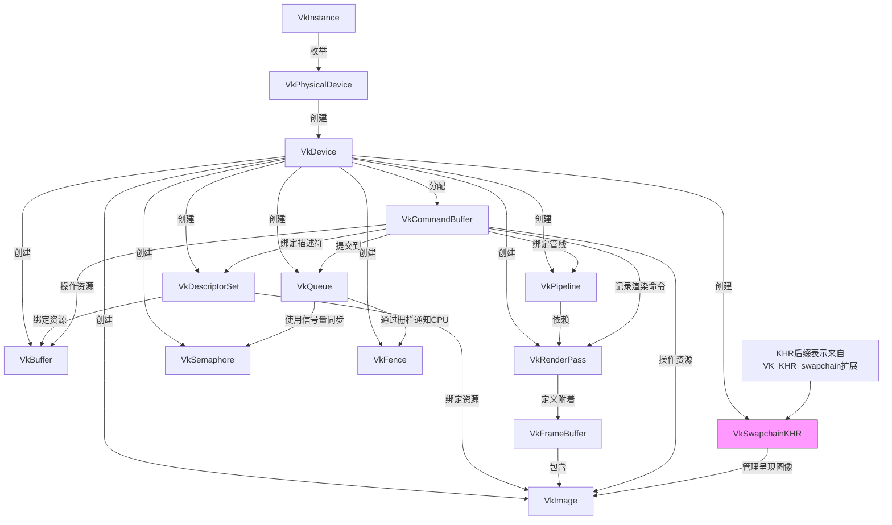

# Vulkan是啥

Vulkan是由Khronos组开发的跨平台图形API(应用程序程序接口). 

比起老牌图形API "OpenGL"来讲, Vulkan的一个重大特点和优势在于**高性能多线程编程**, OpenGL是典型的高级API, 也就是对功能做了很多包装, 能够快速调用一些高级功能而无需了解具体底层逻辑, 对开发者友好; 而Vulkan则是典型的低级API, 对功能的包装可以说几乎没有, 因此编写vulkan渲染代码和编写一个图形驱动程序很像.

在相同硬件和渲染程序逻辑下, Vulkan 相比 OpenGL 的性能提升主要体现在 **CPU 效率优化** 和 **GPU 利用率提升** 两方面.

---

Vulkan 的显式控制和多线程支持显著减少 CPU 驱动层开销：

| **场景**                | OpenGL 帧时间 (ms) | Vulkan 帧时间 (ms) | 提升幅度 |
|-------------------------|--------------------|--------------------|---------|
| 10 万 Draw Calls        | 15.2               | 3.8                | **75%↓**|
| 动态资源更新（每帧 1k 次）| 8.5                | 1.2                | **85%↓**|
| 多线程提交命令          | 不支持             | 支持并行提交        | 理论无限 |

**典型案例**：  
- **《DOOM 2016》**：从 OpenGL 切换到 Vulkan 后，在相同场景下 CPU 帧时间降低 **40-60%**，低端 CPU 的帧率提升达 **2 倍**。  
- **Unreal Engine 测试**：复杂场景（10k+ 物体）中，Vulkan 的 CPU 处理时间比 OpenGL 减少 **30-50%**。

---

Vulkan 的 Pipeline 控制和内存管理更高效：

| **指标**                | OpenGL 表现       | Vulkan 表现       | 提升原因 |
|-------------------------|-------------------|-------------------|---------|
| GPU 占用率              | 70-85%           | 90-98%            | 减少驱动调度延迟 |
| 显存带宽利用率          | 60 GB/s          | 75 GB/s           | 显式内存控制 |
| 复杂着色器编译速度      | 慢（驱动优化黑盒）| 快（预编译 Pipeline）| **Pipeline Cache** |

**实测数据**：  
- **移动端（Adreno 650）**：Vulkan 在渲染相同复杂度的粒子系统时，帧率从 45 FPS（OpenGL）提升至 **68 FPS**，GPU 效率提升 **50%**。  
- **桌面端（RTX 3080）**：在 4K 分辨率下，Vulkan 的 GPU 利用率比 OpenGL 高 **15-20%**，显存带宽浪费减少 **30%**。

---

Vulkan 的 Command Buffer 和多队列支持大幅提升 Draw Call 上限：

| **API**  | 单线程 Draw Calls/帧 | 多线程 Draw Calls/帧 |
|----------|----------------------|----------------------|
| OpenGL   | 10k-20k             | 不支持               |
| Vulkan   | 50k-100k            | 500k-1M+            |

**案例**：  
- **《Quake 2 RTX》**：Vulkan 版本支持每帧 **200 万 Draw Calls**，而 OpenGL 版本在相同硬件下仅能处理 **30 万**。  
- **体素渲染测试**：Vulkan 的多线程提交使 Draw Call 吞吐量提升 **5-8 倍**。

---

Vulkan 的显式控制减少渲染管线延迟：

| **场景**                | OpenGL 延迟 (ms) | Vulkan 延迟 (ms) | 提升幅度 |
|-------------------------|------------------|------------------|---------|
| VR 渲染（单眼 90Hz）    | 12.5             | 8.2              | **34%↓**|
| 实时光线追踪（混合管线）| 22.0             | 15.5             | **30%↓**|

---

根据场景复杂度和优化水平，Vulkan 的综合性能提升范围如下：  
- **简单场景（CPU 瓶颈为主）**：帧率提升 **20-50%**（如 UI 密集型应用）。  
- **复杂场景（GPU/CPU 混合瓶颈）**：帧率提升 **50-200%**（如开放世界游戏、科学可视化）。  
- **极端多线程/高 Draw Call 场景**：性能提升可达 **5-10 倍**（如大规模粒子系统、体素引擎）。

但是如果对vulkan不够了解, 代码结构和设置不合理, 反而可能会导致性能下降.
> 因为用户能够真实操作的计算资源增多, 不合理的代码可能会比高级API消耗的资源更多, 比如不及时将数据从GPU转回CPU等

## Vulkan 验证层

Vulkan API 非常庞大，因此很容易出错，但这就是验证层可以发挥作用的地方. 验证层是Vulkan中的可选功能，它检测和报告API的使用不正确. 

验证层通过拦截函数调用并对数据执行验证来工作。如果所有数据均已正确验证，将执行对驱动程序的调用. 应该注意的是，拦截函数和运行验证会带来性能损失, 同时太多的验证层报错也会让人心态炸裂. 验证层对于捕获错误非常有用, 例如使用不正确的配置, 使用错误的枚举, 同步问题和对象生命周期. 在没有任何报告的验证错误的情况下运行应用程序是一个好兆头, 但这不应该用作应用程序在不同硬件上运行情况的指标. 
>[info] 特殊情况
> 值得注意的是, vulkan并不严格要求验证层完全没有错误, 你可以经常看到控制台一秒上万个验证层报错但是程序依旧正常运行的神奇景象. 因此有验证层错误是正常的, 甚至在一定情况下是可以忽略的. 但同时验证层错误也预示程序存在风险, 本着发扬精益求精的风格, 我还是推荐在开发的过程中逐步测试并解决验证层错误

## Vulkan 思想

在Vulkan中, 几乎所有内容都是围绕你手动创建然后使用的对象设计的, 这不仅用于实际的GPU资源, 例如图像/纹理和缓冲区 (用于内存或顶点数据之类的东西), 还适用于许多“内部”配置结构. 
例如，诸如GPU固定功能（例如rasterizer模式）之类的东西存储在容纳着色器和其他配置的管道对象中. 在OpenGL和DX11中, 这是在渲染时“即时”计算的. 使用Vulkan时, 需要考虑是否值得缓存这些对象, 或者在呈现时创建它们. 

在执行实际的GPU命令时, GPU上的所有工作都必须记录到 **命令(command)** 中, 并提交给队列. 你需要首先分配 **命令缓冲区(command buffer)** , 开始对其进行编码, 然后通过将其添加到 **队列(queue)** 中执行它. 当你将命令缓冲区提交到队列中时, 它才能开始在GPU侧执行. 如果你将多个命令缓冲区提交到不同的队列中, 程序就能并行执行.

在Vulkan中没有所谓"帧"的概念, 这意味着程序的渲染方式完全取决于你自己. 唯一重要的是, 当您必须将"帧"显示到屏幕上时, 这是通过 **交换链(swapchain)** 完成的. 渲染的结果无论是通过网络发送, 或将图像保存到文件中, 或通过交换将其显示到屏幕中, 在vulkan中没有根本上的区别.
这意味着可以在**完全无头模式**下使用 Vulkan, 也就是渲染结果可以在屏幕上不显示任何内容. 你可以渲染图像, 然后直接存储到磁盘上 (对于测试非常有用) 或使用 Vulkan 来执行 GPU 计算, s例如光线追踪器或其他计算任务.

# Vulkan怎么用
## Vulkan 主要元素及其使用

- `VkInstance` ：用于访问驱动程序的Vulkan上下文。
- `VkPhysicalDevice` ：可以理解为你的GPU。用于查询物理GPU细节，例如功能，特性，内存大小等。
- `VkDevice` ：实际运行东西的“逻辑” GPU上下文。
- `VkBuffer` ：一块GPU可见的内存。
- `VkImage` ：可以写入和读取的纹理。
- `VkPipeline` ：保持绘制所需的GPU状态。例如：着色器，栅格化选项，深度设置。
- `VkRenderPass` ：保留有关要渲染的图像的信息。所有绘图命令都必须在RenderPass内完成。
- `VkFrameBuffer` ：持有RenderPass的目标图像。
- `VkCommandBuffer` ：编码 GPU 命令。在 GPU 本身（而不是在程序中）运行的所有代码都必须编码在`VkCommandBuffer`中。
- `VkQueue` ：命令的执行“端口”。 GPU 将具有一组具有不同属性的队列（有些只允许图形命令，有些只允许内存命令等）命令缓冲区通过将它们提交到队列中来执行，队列会将渲染命令复制到 GPU 上运行。
- `VkDescriptorSet` ：保存将着色器输入连接到数据（比如`VkBuffer`资源和`VkImage`纹理等）的绑定信息。将其视为一组绑定一次的 GPU 端指针。
- `VkSwapchainKHR` ：保存屏幕的图像。它可以将事物渲染到可见的窗口中。 `KHR`后缀显示它来自扩展名，在这种情况下为`VK_KHR_swapchain`
- `VkSemaphore` ：同步GPU到GPU的命令执行过程。用于同步多个命令缓冲区提交。
- `VkFence` ：将GPU同步到CPU执行命令。用于知晓命令缓冲区是否已在GPU上执行。


## 先进Vulkan程序流

### 1. 引擎初始化

首先，要初始化所有内容。
要初始化 Vulkan，首先要创建一个 `VkInstance`。从 `VkInstance` 中，你可以查询你机子中可用的 `VkPhysicalDevice`句柄列表。例如，如果计算机同时具有数个独立 GPU 和集成显卡，则每个 GPU 都有一个 `VkPhysicalDevice`。
在查询可用 VkPhysicalDevice 句柄的限制和功能后，从中创建 VkDevice。使用 VkDevice，就可以从中获取 VkQueue 句柄，从而执行命令。然后初始化 VkSwapchainKHR（当然你的目的是用做有头渲染）。除了 VkQueue 句柄，您还可以创建 VkCommandPool 对象，以便从中分配命令缓冲区。

### 2. 资源初始化

一旦初始化了核心结构，就可以初始化渲染所需的资源。将加载材质，并为渲染材质所需的着色器组合和参数创建一组VkPipeline对象。对于网格，将其顶点数据上传到VkBuffer资源，并将其纹理上传到VkImage资源，确保图像处于“可读”布局。你还可以为所有主渲染过程创建VkRenderPass对象。例如，可能有一个VkRenderPass用于主渲染，另一个用于阴影过程。在一个真实的引擎上，这些都可以并行化，并在后台线程中完成，特别是因为管道创建可能非常昂贵。

### 3. 渲染循环

现在一切都准备就绪，可以开始渲染了。首先，你需要向 VkSwapchainKHR 请求一个用于渲染的图像。然后，从 VkCommandBufferPool 中分配一个 VkCommandBuffer，或者复用一个已经执行完毕的命令缓冲区，并“启动”该命令缓冲区，这样你就可以向其中写入命令。接下来，通过启动一个 VkRenderPass 来开始渲染，这可以使用普通的 VkRenderPass，也可以使用动态渲染。渲染通道指定你正在渲染到从交换链请求的图像。然后创建一个循环，在循环中绑定一个 VkPipeline，绑定一些 VkDescriptorSet 资源（用于着色器参数），绑定顶点缓冲区，然后执行一个绘制调用。完成一个通道的绘制后，结束 VkRenderPass。如果没有更多要渲染的内容，就结束 VkCommandBuffer。最后，将命令缓冲区提交到队列中进行渲染。这将开始在 GPU 上执行命令缓冲区中的命令。如果你想显示渲染结果，你需要将渲染好的图像“呈现”到屏幕上。由于执行可能尚未完成，你需要使用信号量来使图像的呈现等待渲染完成。

### 4. Vulkan渲染循环伪代码

```cpp
// 请求交换链渲染图像
int image_index = request_image(mySwapchain);

// 创建CommandBuffer
VkCommandBuffer cmd = allocate_command_buffer();

// 初始化command buffer
vkBeginCommandBuffer(cmd, ... );

// 创建新render pass
// Each framebuffer refers to a image in the swapchain
vkCmdBeginRenderPass(cmd, main_render_pass, framebuffers[image_index] );

// 渲染循环
for(object in PassObjects){

    // Bind the shaders and configuration used to render the object
    vkCmdBindPipeline(cmd, object.pipeline);
    
    // Bind the vertex and index buffers for rendering the object
    vkCmdBindVertexBuffers(cmd, object.VertexBuffer,...);
    vkCmdBindIndexBuffer(cmd, object.IndexBuffer,...);

    // Bind the descriptor sets for the object (shader inputs)
    vkCmdBindDescriptorSets(cmd, object.textureDescriptorSet);
    vkCmdBindDescriptorSets(cmd, object.parametersDescriptorSet);

    // Execute drawing
    vkCmdDraw(cmd,...);
}

// 结束 render pass 和 command buffer
vkCmdEndRenderPass(cmd);
vkEndCommandBuffer(cmd);


// 提交command buffer到GPU
vkQueueSubmit(graphicsQueue, cmd, ...);

// 显示图像
// renderSemaphore makes sure the image isn't presented until `cmd` is finished executing
vkQueuePresent(graphicsQueue, renderSemaphore);
```

