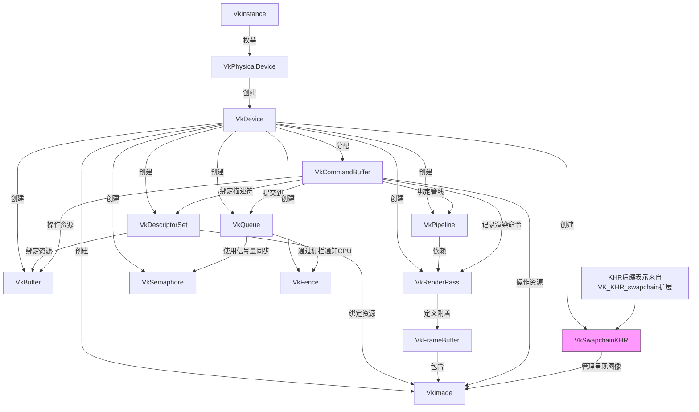

# Vulkan是啥

Vulkan是由Khronos组开发的跨平台图形API(应用程序程序接口). 

比起老牌图形API "OpenGL"来讲, Vulkan的一个重大特点和优势在于**高性能多线程编程**, OpenGL是典型的高级API, 也就是对功能做了很多包装, 能够快速调用一些高级功能而无需了解具体底层逻辑, 对开发者友好; 而Vulkan则是典型的低级API, 对功能的包装可以说几乎没有, 因此编写vulkan渲染代码和编写一个图形驱动程序很像.

在相同硬件和渲染程序逻辑下, Vulkan 相比 OpenGL 的性能提升主要体现在 **CPU 效率优化** 和 **GPU 利用率提升** 两方面.

---

Vulkan 的显式控制和多线程支持显著减少 CPU 驱动层开销：

| **场景**                | OpenGL 帧时间 (ms) | Vulkan 帧时间 (ms) | 提升幅度 |
|-------------------------|--------------------|--------------------|---------|
| 10 万 Draw Calls        | 15.2               | 3.8                | **75%↓**|
| 动态资源更新（每帧 1k 次）| 8.5                | 1.2                | **85%↓**|
| 多线程提交命令          | 不支持             | 支持并行提交        | 理论无限 |

**典型案例**：  
- **《DOOM 2016》**：从 OpenGL 切换到 Vulkan 后，在相同场景下 CPU 帧时间降低 **40-60%**，低端 CPU 的帧率提升达 **2 倍**。  
- **Unreal Engine 测试**：复杂场景（10k+ 物体）中，Vulkan 的 CPU 处理时间比 OpenGL 减少 **30-50%**。

---

Vulkan 的 Pipeline 控制和内存管理更高效：

| **指标**                | OpenGL 表现       | Vulkan 表现       | 提升原因 |
|-------------------------|-------------------|-------------------|---------|
| GPU 占用率              | 70-85%           | 90-98%            | 减少驱动调度延迟 |
| 显存带宽利用率          | 60 GB/s          | 75 GB/s           | 显式内存控制 |
| 复杂着色器编译速度      | 慢（驱动优化黑盒）| 快（预编译 Pipeline）| **Pipeline Cache** |

**实测数据**：  
- **移动端（Adreno 650）**：Vulkan 在渲染相同复杂度的粒子系统时，帧率从 45 FPS（OpenGL）提升至 **68 FPS**，GPU 效率提升 **50%**。  
- **桌面端（RTX 3080）**：在 4K 分辨率下，Vulkan 的 GPU 利用率比 OpenGL 高 **15-20%**，显存带宽浪费减少 **30%**。

---

Vulkan 的 Command Buffer 和多队列支持大幅提升 Draw Call 上限：

| **API**  | 单线程 Draw Calls/帧 | 多线程 Draw Calls/帧 |
|----------|----------------------|----------------------|
| OpenGL   | 10k-20k             | 不支持               |
| Vulkan   | 50k-100k            | 500k-1M+            |

**案例**：  
- **《Quake 2 RTX》**：Vulkan 版本支持每帧 **200 万 Draw Calls**，而 OpenGL 版本在相同硬件下仅能处理 **30 万**。  
- **体素渲染测试**：Vulkan 的多线程提交使 Draw Call 吞吐量提升 **5-8 倍**。

---

Vulkan 的显式控制减少渲染管线延迟：

| **场景**                | OpenGL 延迟 (ms) | Vulkan 延迟 (ms) | 提升幅度 |
|-------------------------|------------------|------------------|---------|
| VR 渲染（单眼 90Hz）    | 12.5             | 8.2              | **34%↓**|
| 实时光线追踪（混合管线）| 22.0             | 15.5             | **30%↓**|

---

根据场景复杂度和优化水平，Vulkan 的综合性能提升范围如下：  
- **简单场景（CPU 瓶颈为主）**：帧率提升 **20-50%**（如 UI 密集型应用）。  
- **复杂场景（GPU/CPU 混合瓶颈）**：帧率提升 **50-200%**（如开放世界游戏、科学可视化）。  
- **极端多线程/高 Draw Call 场景**：性能提升可达 **5-10 倍**（如大规模粒子系统、体素引擎）。

但是如果对vulkan不够了解, 代码结构和设置不合理, 反而可能会导致性能下降.
> 因为用户能够真实操作的计算资源增多, 不合理的代码可能会比高级API消耗的资源更多, 比如不及时将数据从GPU转回CPU等

## Vulkan 验证层

Vulkan API 非常庞大，因此很容易出错，但这就是验证层可以发挥作用的地方. 验证层是Vulkan中的可选功能，它检测和报告API的使用不正确. 

验证层通过拦截函数调用并对数据执行验证来工作。如果所有数据均已正确验证，将执行对驱动程序的调用. 应该注意的是，拦截函数和运行验证会带来性能损失, 同时太多的验证层报错也会让人心态炸裂. 验证层对于捕获错误非常有用, 例如使用不正确的配置, 使用错误的枚举, 同步问题和对象生命周期. 在没有任何报告的验证错误的情况下运行应用程序是一个好兆头, 但这不应该用作应用程序在不同硬件上运行情况的指标. 
>[info] 特殊情况
> 值得注意的是, vulkan并不严格要求验证层完全没有错误, 你可以经常看到控制台一秒上万个验证层报错但是程序依旧正常运行的神奇景象. 因此有验证层错误是正常的, 甚至在一定情况下是可以忽略的. 但同时验证层错误也预示程序存在风险, 本着发扬精益求精的风格, 我还是推荐在开发的过程中逐步测试并解决验证层错误

## Vulkan 思想

在Vulkan中, 几乎所有内容都是围绕你手动创建然后使用的对象设计的, 这不仅用于实际的GPU资源, 例如图像/纹理和缓冲区 (用于内存或顶点数据之类的东西), 还适用于许多“内部”配置结构. 
例如，诸如GPU固定功能（例如rasterizer模式）之类的东西存储在容纳着色器和其他配置的管道对象中. 在OpenGL和DX11中, 这是在渲染时“即时”计算的. 使用Vulkan时, 需要考虑是否值得缓存这些对象, 或者在呈现时创建它们. 

在执行实际的GPU命令时, GPU上的所有工作都必须记录到 **命令(command)** 中, 并提交给队列. 你需要首先分配 **命令缓冲区(command buffer)** , 开始对其进行编码, 然后通过将其添加到 **队列(queue)** 中执行它. 当你将命令缓冲区提交到队列中时, 它才能开始在GPU侧执行. 如果你将多个命令缓冲区提交到不同的队列中, 程序就能并行执行.

在Vulkan中没有所谓"帧"的概念, 这意味着程序的渲染方式完全取决于你自己. 唯一重要的是, 当您必须将"帧"显示到屏幕上时, 这是通过 **交换链(swapchain)** 完成的. 渲染的结果无论是通过网络发送, 或将图像保存到文件中, 或通过交换将其显示到屏幕中, 在vulkan中没有根本上的区别.
这意味着可以在**完全无头模式**下使用 Vulkan, 也就是渲染结果可以在屏幕上不显示任何内容. 你可以渲染图像, 然后直接存储到磁盘上 (对于测试非常有用) 或使用 Vulkan 来执行 GPU 计算, s例如光线追踪器或其他计算任务.

# Vulkan怎么用
## Vulkan 主要元素及其使用

- `VkInstance` ：用于访问驱动程序的Vulkan上下文。
- `VkPhysicalDevice` ：可以理解为你的GPU。用于查询物理GPU细节，例如功能，特性，内存大小等。
- `VkDevice` ：实际运行东西的“逻辑” GPU上下文。
- `VkBuffer` ：一块GPU可见的内存。
- `VkImage` ：可以写入和读取的纹理。
- `VkPipeline` ：保持绘制所需的GPU状态。例如：着色器，栅格化选项，深度设置。
- `VkRenderPass` ：保留有关要渲染的图像的信息。所有绘图命令都必须在RenderPass内完成。
- `VkFrameBuffer` ：持有RenderPass的目标图像。
- `VkCommandBuffer` ：编码 GPU 命令。在 GPU 本身（而不是在程序中）运行的所有代码都必须编码在`VkCommandBuffer`中。
- `VkQueue` ：命令的执行“端口”。 GPU 将具有一组具有不同属性的队列（有些只允许图形命令，有些只允许内存命令等）命令缓冲区通过将它们提交到队列中来执行，队列会将渲染命令复制到 GPU 上运行。
- `VkDescriptorSet` ：保存将着色器输入连接到数据（比如`VkBuffer`资源和`VkImage`纹理等）的绑定信息。将其视为一组绑定一次的 GPU 端指针。
- `VkSwapchainKHR` ：保存屏幕的图像。它可以将事物渲染到可见的窗口中。 `KHR`后缀显示它来自扩展名，在这种情况下为`VK_KHR_swapchain`
- `VkSemaphore` ：同步GPU到GPU的命令执行过程。用于同步多个命令缓冲区提交。
- `VkFence` ：将GPU同步到CPU执行命令。用于知晓命令缓冲区是否已在GPU上执行。


## 先进Vulkan程序流

### 1. 引擎初始化

首先，要初始化所有内容。
要初始化 Vulkan，首先要创建一个 `VkInstance`。从 `VkInstance` 中，你可以查询你机子中可用的 `VkPhysicalDevice`句柄列表。例如，如果计算机同时具有数个独立 GPU 和集成显卡，则每个 GPU 都有一个 `VkPhysicalDevice`。

在查询可用 VkPhysicalDevice 句柄的限制和功能后，从中创建 VkDevice。使用 VkDevice，就可以从中获取 VkQueue 句柄，从而执行命令。然后初始化 VkSwapchainKHR（当然你的目的是用做有头渲染）。除了 VkQueue 句柄，您还可以创建 VkCommandPool 对象，以便从中分配命令缓冲区。

### 2. 资源初始化

一旦初始化了核心结构，就可以初始化渲染所需的资源。将加载材质，并为渲染材质所需的着色器组合和参数创建一组VkPipeline对象。对于网格，将其顶点数据上传到VkBuffer资源，并将其纹理上传到VkImage资源，确保图像处于“可读”布局。你还可以为所有主渲染过程创建VkRenderPass对象。例如，可能有一个VkRenderPass用于主渲染，另一个用于阴影过程。在一个真实的引擎上，这些都可以并行化，并在后台线程中完成，特别是因为管道创建可能非常昂贵。

### 3. 渲染循环

现在一切都准备就绪，可以开始渲染了。首先，你需要向 VkSwapchainKHR 请求一个用于渲染的图像。然后，从 VkCommandBufferPool 中分配一个 VkCommandBuffer，或者复用一个已经执行完毕的命令缓冲区，并“启动”该命令缓冲区，这样你就可以向其中写入命令。

接下来，通过启动一个 VkRenderPass 来开始渲染，这可以使用普通的 VkRenderPass，也可以使用动态渲染。渲染通道指定你正在渲染到从交换链请求的图像。然后创建一个循环，在循环中绑定一个 VkPipeline，绑定一些 VkDescriptorSet 资源（用于着色器参数），绑定顶点缓冲区，然后执行一个绘制调用。

完成一个通道的绘制后，结束 VkRenderPass。如果没有更多要渲染的内容，就结束VkCommandBuffer。最后，将命令缓冲区提交到队列中进行渲染。这将开始在 GPU 上执行命令缓冲区中的命令。如果你想显示渲染结果，你需要将渲染好的图像“呈现”到屏幕上。由于执行可能尚未完成，你需要使用信号量来使图像的呈现等待渲染完成。

## 代码演示

接下来通过具体的vulkan代码，可以更加明确的了解上述的渲染循环是怎么循环的：

### 1. 主循环`run()`

```cpp
//vk_engine.cpp

// 引擎的主循环
// 处理用户输入、更新UI并调用渲染函数
void VulkanEngine::run()
{

	SDL_Event e;
	bool bQuit = false;

// 主循环
// 处理用户输入并执行渲染
	while (!bQuit) {
		// 处理事件队列中的事件
		while (SDL_PollEvent(&e) != 0) {
			// 当用户按Alt-F4或点击X按钮时关闭窗口
			if (e.type == SDL_QUIT)
				bQuit = true;
			// 处理窗口事件
			if (e.type == SDL_WINDOWEVENT) {
				// 当窗口被最小化时，停止渲染
				if (e.window.event == SDL_WINDOWEVENT_MINIMIZED) {
					freeze_rendering = true;
				}
				// 当窗口被恢复时，恢复渲染
				if (e.window.event == SDL_WINDOWEVENT_RESTORED) {
					freeze_rendering = false;
				}
			}
			ImGui_ImplSDL2_ProcessEvent(&e);
		}
		
		if (freeze_rendering) {
		// 通过睡眠来限制循环速度，避免无意义的CPU占用
			std::this_thread::sleep_for(std::chrono::milliseconds(100));
			continue;
		}
		
		if (resize_requested) {
			resize_swapchain();
		}
		
		ImGui_ImplVulkan_NewFrame();
		ImGui_ImplSDL2_NewFrame();
		
		ImGui::NewFrame();
		
		if (ImGui::Begin("background")) {
			ImGui::SliderFloat("Render Scale",&renderScale, 0.3f, 1.f);
			ComputeEffect& selected = backgroundEffects[currentBackgroundEffect];
			ImGui::Text("Selected effect: ", selected.name);
			ImGui::SliderInt("Effect Index", &currentBackgroundEffect,0, backgroundEffects.size() - 1);
			ImGui::InputFloat4("data1",(float*)& selected.data.data1);
			ImGui::InputFloat4("data2",(float*)& selected.data.data2);
			ImGui::InputFloat4("data3",(float*)& selected.data.data3);
			ImGui::InputFloat4("data4",(float*)& selected.data.data4);
		}
		
		ImGui::End();
		ImGui::Render();
		
		draw();
		
	}
}
```

这段代码就是“主循环”，除了部分情况以外（代码中设置只要不关闭窗口）就`while(true)`的持续循环。
ImGui是一个好用的UI库，可以在渲染过程中动态的调整代码中的参数，甚至可以将参数传入shader中更改渲染效果，后续会将单独开一章来讲ImGui的内容。
```cpp
		if (ImGui::Begin("background")) {
			ImGui::SliderFloat("Render Scale",&renderScale, 0.3f, 1.f);
			ComputeEffect& selected = backgroundEffects[currentBackgroundEffect];
			ImGui::Text("Selected effect: ", selected.name);
			ImGui::SliderInt("Effect Index", &currentBackgroundEffect,0, backgroundEffects.size() - 1);
			ImGui::InputFloat4("data1",(float*)& selected.data.data1);
			ImGui::InputFloat4("data2",(float*)& selected.data.data2);
			ImGui::InputFloat4("data3",(float*)& selected.data.data3);
			ImGui::InputFloat4("data4",(float*)& selected.data.data4);
		}
```
这一段参数设置代码的各种输入参数都将对渲染就过产生影响，例如滑动条控制的Render Scale会影响渲染分辨率，主要是对渲染图像乘上一个缩放比例的方式来实现的。

run函数中的重点就是只在最后一行，也就是`draw()`函数的调用，draw函数中包括的整个‘绘制流程’，从某种方面来讲，draw函数才是真正的主渲染循环：

### 2. 绘制函数`draw()`

```cpp
//vk_engine.cpp

// 主要的渲染函数
// 负责每一帧的渲染过程，包括同步、命令记录和提交
void VulkanEngine::draw()
{
	
	// 等待上一帧的渲染完成
	// 使用栅栏来同步CPU和GPU的工作
	VK_CHECK(vkWaitForFences(_device, 1, &get_current_frame()._renderFence, true, 1000000000));
	
	get_current_frame()._deletionQueue.flush();
	
	// 从交换链中获取下一个可用的图像
	uint32_t swapchainImageIndex;
	VkResult e = vkAcquireNextImageKHR(_device, _swapchain, 1000000000, get_current_frame()._swapchainSemaphore, nullptr, &swapchainImageIndex);

	if (e == VK_ERROR_OUT_OF_DATE_KHR) {
		resize_requested = true;
		return;
	}

	// 更新绘制区域大小
	_drawExtent.height = std::min(_swapchainExtent.height, _drawImage.imageExtent.height) * renderScale;
	_drawExtent.width = std::min(_swapchainExtent.width, _drawImage.imageExtent.width) * renderScale;

	VK_CHECK(vkResetFences(_device, 1, &get_current_frame()._renderFence));

	// 使用较短的变量名 cmd 来引用命令缓冲区
	VkCommandBuffer cmd = get_current_frame()._mainCommandBuffer;

	// 当前帧的命令已经执行完成
	// 现在可以安全地重置命令缓冲区，开始新一轮的命令记录
	VK_CHECK(vkResetCommandBuffer(cmd, 0));


	// 开始命令缓冲区的记录
	// 这个命令缓冲区只会使用一次，所以我们告诉Vulkan这一点
	VkCommandBufferBeginInfo cmdBeginInfo = vkinit::command_buffer_begin_info(VK_COMMAND_BUFFER_USAGE_ONE_TIME_SUBMIT_BIT);

	VK_CHECK(vkBeginCommandBuffer(cmd, &cmdBeginInfo));
	
	// 将主绘制图像转换为通用布局，以便我们可以写入内容
	// 由于我们会完全覆盖这个图像，所以不需要关心之前的布局
	vkutil::transition_image(cmd, _drawImage.image, VK_IMAGE_LAYOUT_UNDEFINED, VK_IMAGE_LAYOUT_GENERAL);
	
	// 绘制背景
	// 在_drawImage.image上绘制，而不是直接在交换链上绘制
	// 这样可以获得更高的分辨率和更好的渲染质量
	draw_background(cmd);

	// 将绘制图像和交换链图像转换为正确的传输布局
	
	vkutil::transition_image(cmd, _drawImage.image, VK_IMAGE_LAYOUT_GENERAL, VK_IMAGE_LAYOUT_COLOR_ATTACHMENT_OPTIMAL);
	vkutil::transition_image(cmd, _depthImage.image, VK_IMAGE_LAYOUT_UNDEFINED, VK_IMAGE_LAYOUT_DEPTH_ATTACHMENT_OPTIMAL);

	draw_geometry(cmd);
	
	// 绘制图像转换为传输源布局
	//交换链图像转换为传输目标布局
	vkutil::transition_image(cmd, _drawImage.image, VK_IMAGE_LAYOUT_COLOR_ATTACHMENT_OPTIMAL, VK_IMAGE_LAYOUT_TRANSFER_SRC_OPTIMAL);
	vkutil::transition_image(cmd, _swapchainImages[swapchainImageIndex], VK_IMAGE_LAYOUT_UNDEFINED, VK_IMAGE_LAYOUT_TRANSFER_DST_OPTIMAL);
	
	// 将绘制图像的内容复制到交换链图像中
	// 这一步将我们绘制的内容传输到最终显示的缓冲区中
	vkutil::copy_image_to_image(cmd, _drawImage.image, _swapchainImages[swapchainImageIndex], _drawExtent, _swapchainExtent);
	
	// 将交换链图像的布局转换为颜色附件布局
	// 这是为了准备绘制ImGui
	vkutil::transition_image(cmd, _swapchainImages[swapchainImageIndex], VK_IMAGE_LAYOUT_TRANSFER_DST_OPTIMAL, VK_IMAGE_LAYOUT_COLOR_ATTACHMENT_OPTIMAL);

	draw_imgui(cmd, _swapchainImageViews[swapchainImageIndex]);

	// 将交换链图像的布局转换为呈现源布局
	// 这是最后一步，为了能在屏幕上显示图像
	vkutil::transition_image(cmd, _swapchainImages[swapchainImageIndex], VK_IMAGE_LAYOUT_COLOR_ATTACHMENT_OPTIMAL, VK_IMAGE_LAYOUT_PRESENT_SRC_KHR);

	// 结束命令缓冲区的记录
	// 此后不能再添加新的命令，但可以执行这个命令缓冲区
	VK_CHECK(vkEndCommandBuffer(cmd));

	VkCommandBufferSubmitInfo cmdinfo = vkinit::command_buffer_submit_info(cmd);
	
	VkSemaphoreSubmitInfo waitInfo = vkinit::semaphore_submit_info(VK_PIPELINE_STAGE_2_COLOR_ATTACHMENT_OUTPUT_BIT_KHR,get_current_frame()._swapchainSemaphore);
	VkSemaphoreSubmitInfo signalInfo = vkinit::semaphore_submit_info(VK_PIPELINE_STAGE_2_ALL_GRAPHICS_BIT, get_current_frame()._renderSemaphore);
	
	VkSubmitInfo2 submit = vkinit::submit_info(&cmdinfo,&signalInfo,&waitInfo);

	// 将命令缓冲区提交到图形队列并执行
	// _renderFence会阻塞直到所有图形命令执行完成
	VK_CHECK(vkQueueSubmit2(_graphicsQueue, 1, &submit, get_current_frame()._renderFence));


	// 准备呈现图像
	// 这一步会将我们刚才渲染的图像显示在窗口
	// 我们需要等待_renderSemaphore
	// 因为必须等所有绘制命令完成后才能将图像显示给用户
	VkPresentInfoKHR presentInfo = {};
	presentInfo.sType = VK_STRUCTURE_TYPE_PRESENT_INFO_KHR;
	presentInfo.pNext = nullptr;
	presentInfo.pSwapchains = &_swapchain;
	presentInfo.swapchainCount = 1;
	presentInfo.pWaitSemaphores = &get_current_frame()._renderSemaphore;
	presentInfo.waitSemaphoreCount = 1;
	presentInfo.pImageIndices = &swapchainImageIndex;
	
	VkResult presentResult = vkQueuePresentKHR(_graphicsQueue, &presentInfo);
	
	if (presentResult == VK_ERROR_OUT_OF_DATE_KHR) {
		resize_requested = true;
	}
	
	// 增加已绘制的帧数
	_frameNumber++;
}
```

完整的draw过程看着挺复杂，其实也一点都不简单。因为vulkan的设置过程很底层，带来高性能与高自定义的同时也会导致上手更加困难，这个函数就很好的体现了这一点，原本在OpenGL可能几句代码就能完成的操作需要开发者自己进行设置与处理。

#### 绘制前的善后与开头工作

绘制过程一开始是等待上一帧绘制的完成，由于渲染需要遵循严格的时序性，因此等待与同步将贯穿vulkan API编程。
```cpp
	// 等待上一帧的渲染完成
	// 使用栅栏来同步CPU和GPU的工作
	VK_CHECK(vkWaitForFences(_device, 1, &get_current_frame()._renderFence, true, 1000000000));
```

如果你了解并行计算或者操作系统，你大概会对这个Fence和之后的wait&signal比较熟悉，简而言之就是通过Fence的状态来判断上一帧是否已经绘制完成，同时我设置了一个超长的超时时间，就是为了防止帧渲染缓慢导致超时进而程序崩溃。

上一帧渲染好了，程序从交换链中获得下一帧图像进行绘制：
```cpp
	get_current_frame()._deletionQueue.flush();
	
	// 从交换链中获取下一个可用的图像
	uint32_t swapchainImageIndex;
	VkResult e = vkAcquireNextImageKHR(_device, _swapchain, 1000000000, get_current_frame()._swapchainSemaphore, nullptr, &swapchainImageIndex);

	if (e == VK_ERROR_OUT_OF_DATE_KHR) {
		resize_requested = true;
		return;
	}

	// 更新绘制区域大小
	_drawExtent.height = std::min(_swapchainExtent.height, _drawImage.imageExtent.height) * renderScale;
	_drawExtent.width = std::min(_swapchainExtent.width, _drawImage.imageExtent.width) * renderScale;
```

先调用析构函数队列的`flush()`方法将帧清空，这个乍一看很奇妙，明明帧数在最后自加不应该出现相同或者被占用的情况呀！但其实帧数据的存储方式是这样的：
```cpp
//vk_engine.h

constexpr unsigned int FRAME_OVERLAP = 2;
FrameData _frames[FRAME_OVERLAP];

FrameData& get_current_frame() { return _frames[_frameNumber % FRAME_OVERLAP]; };
```
仔细想想，内存也承受不住存储这些一直增长的帧，因此其实帧只存储几个（在这里是两个）用于轮换的备用帧，然后取帧数除以总备用的余数来看该用哪个备用帧了。因此在轮换过程中自然会出现备用帧被使用过的情况，因此必须先进行清空初始化。

初始化清空后就可以从交换链中取供绘制的图像了
```cpp
	// 从交换链中获取下一个可用的图像
	uint32_t swapchainImageIndex;
	VkResult e = vkAcquireNextImageKHR(_device, _swapchain, 1000000000, get_current_frame()._swapchainSemaphore, nullptr, &swapchainImageIndex);
```
但是`vkAcquireNextImageKHR`函数有一个稍微令人困惑的参数：`get_current_frame()._swapchainSemaphore` 这个VkSemaphore其实也是用于同步，但和Fence的区别在于**Semaphore（信号量）是用于 GPU 内部队列之间的同步，Fence（栅栏）主要用于 CPU 与 GPU 之间的同步**，在draw函数涉及到队列的部分在最后的提交命令部分。

获取图像后有一个窗口大小的检查
```cpp
	if (e == VK_ERROR_OUT_OF_DATE_KHR) {
		resize_requested = true;
		return;
	}

	// 更新绘制区域大小
	_drawExtent.height = std::min(_swapchainExtent.height, _drawImage.imageExtent.height) * renderScale;
	_drawExtent.width = std::min(_swapchainExtent.width, _drawImage.imageExtent.width) * renderScale;
```
这个`e`是函数`vkAcquireNextImageKHR`的返回内容，在这个检查中`VK_ERROR_OUT_OF_DATE_KHR`代表图像信息有变化（窗口大小变化后渲染图像大小也变了），因此设置需要resize并返回，也就是说这一帧其实没渲染，然后`run()`函数循环到下一帧中调用重新设置大小图像大小的函数进行更新。
> [!info] Vulkan函数返回
> 这种传入指针参数在函数内修改而不使用返回值或者返回执行状态的函数形式在Vulkan中相当常见（应该是一种先进的c++编程技巧），因为vulkan函数常常要改变多个数值并且还会有多种错误情况
> 在上文也有VK_CHECK()这样的内联函数便于开发者检查重要函数（如命令缓冲区开始结束以及提交等会影响到程序能否执行下去的函数，一般只影响渲染效果不影响执行的不算重要函数）的执行情况

正确取得图像后就可以准备开始绘制了，但是在绘制前需要先把同步栅栏与命令缓冲区都创建和重置以及初始化：
```cpp
	VK_CHECK(vkResetFences(_device, 1, &get_current_frame()._renderFence));
	// 使用较短的变量名 cmd 来引用命令缓冲区
	VkCommandBuffer cmd = get_current_frame()._mainCommandBuffer;
	// 当前帧的命令已经执行完成
	// 现在可以安全地重置命令缓冲区，开始新一轮的命令记录
	VK_CHECK(vkResetCommandBuffer(cmd, 0));
	
	VkCommandBufferBeginInfo cmdBeginInfo = vkinit::command_buffer_begin_info(VK_COMMAND_BUFFER_USAGE_ONE_TIME_SUBMIT_BIT);
```
用VK_CHECK保护起来重要的函数了

然后终于可以开始绘制了
#### 绘制中的操作与问题
```cpp
	//...
	VK_CHECK(vkBeginCommandBuffer(cmd, &cmdBeginInfo));
	
	// 将主绘制图像转换为通用布局，以便我们可以写入内容
	// 由于我们会完全覆盖这个图像，所以不需要关心之前的布局
	vkutil::transition_image(cmd, _drawImage.image, VK_IMAGE_LAYOUT_UNDEFINED, VK_IMAGE_LAYOUT_GENERAL);
	
	// 绘制背景
	// 在_drawImage.image上绘制，而不是直接在交换链上绘制
	// 这样可以获得更高的分辨率和更好的渲染质量
	draw_background(cmd);

	// 将绘制图像和交换链图像转换为正确的传输布局
	
	vkutil::transition_image(cmd, _drawImage.image, VK_IMAGE_LAYOUT_GENERAL, VK_IMAGE_LAYOUT_COLOR_ATTACHMENT_OPTIMAL);
	vkutil::transition_image(cmd, _depthImage.image, VK_IMAGE_LAYOUT_UNDEFINED, VK_IMAGE_LAYOUT_DEPTH_ATTACHMENT_OPTIMAL);

	draw_geometry(cmd);
	//...
```
绘制的开始语句是开始命令缓冲区的记录，毕竟不把函数记录在cmd里的话相当于白执行。

紧接着我们遇到了draw函数中的第一个，并且将在后面遇到很多次的`transition_image`函数，这个函数是转换VkImage图像的布局信息，这里涉及到Vulkan中一个机制：图像布局

因为VkImage是一个‘很大’的vulkan变量，可以被成为图像的都用它（如渲染结果的图像，记录深度信息的深度图ShadowMap，场景G-Buffer信息等等），因为**不同的 GPU 操作需要以特定的方式组织图像数据，以实现最佳性能和正确性**，可以看 [Reddit上对图像布局的回答](https://www.reddit.com/r/vulkan/comments/48cvzq/image_layouts/)。不同的布局代表了图像数据在内存中的不同组织方式，以及 GPU 对图像数据的不同访问权限。

以下是 `VkImage` 需要不同布局的一些关键原因：

1. **硬件优化**：不同的硬件架构可能需要不同的数据布局才能实现最佳性能。例如，某些操作可能需要线性布局，而其他操作可能需要平铺布局 。
    
2. **数据访问权限**：不同的操作可能需要不同的数据访问权限。例如，渲染操作可能需要对图像进行读写访问，而着色器可能只需要读取图像数据。通过使用不同的布局，可以限制对图像数据的访问，从而提高安全性和性能。
    
3. **图像用途**：图像的用途也会影响其布局。例如，用作颜色附件的图像可能需要与用作深度/模板附件的图像不同的布局（上面的代码段就有）。

具体的`VkImageLayout`有很多，在这里就不列举了，可以去vulkan的官网上查找。在当前的绘制阶段用到了
- `VK_IMAGE_LAYOUT_UNDEFINED`：初始布局或未知布局。图像内存不能转换到此布局。
- `VK_IMAGE_LAYOUT_GENERAL`：支持所有类型的设备访问，除非另有说明。
- `VK_IMAGE_LAYOUT_COLOR_ATTACHMENT_OPTIMAL`：必须仅用作 `VkFramebuffer` 中的颜色或解析附件。
- `VK_IMAGE_LAYOUT_DEPTH_ATTACHMENT_OPTIMAL`：允许对深度/模板格式图像的深度和模板方面进行读写访问，作为深度/模板附件。
后面还有其他布局，这里先暂时不做介绍。

由于初始布局是不支持设备访问的，因此也不能用于绘制。我们这里选择将初始布局转换为通用布局，因为绘制背景使用计算着色器，不涉及到深度检查和面片着色等问题。可以去后面浅看一下[`draw_background`函数](#`draw_background`)来具体了解如何绘制的。


### 3.绘制函数的辅助（并非辅助）函数们

#### `draw_background`
```cpp
// 绘制背景
// 使用计算着色器来绘制背景效果

void VulkanEngine::draw_background(VkCommandBuffer cmd)
{
	// 创建一个基于帧数的闪烁效果
	// 每120帧完成一个周期
	VkClearColorValue clearValue;
	float flash = std::abs(std::sin(_frameNumber / 120.f));
	clearValue = { { 0.0f, 0.0f, flash, 1.0f } };
	
	
	VkImageSubresourceRange clearRange = vkinit::image_subresource_range(VK_IMAGE_ASPECT_COLOR_BIT);
	
	//clear image
	//vkCmdClearColorImage(cmd, _drawImage.image, VK_IMAGE_LAYOUT_GENERAL, &clearValue, 1, &clearRange);
	ComputeEffect& effect = backgroundEffects[currentBackgroundEffect];
	
	// 绑定渐变绘制的计算管线
	// 这个管线用于生成背景效果
	vkCmdBindPipeline(cmd, VK_PIPELINE_BIND_POINT_COMPUTE, effect.pipeline);
	
	// 绑定包含绘制图像的描述符集
	// 这个描述符集包含了计算着色器需要的资源
	vkCmdBindDescriptorSets(cmd, VK_PIPELINE_BIND_POINT_COMPUTE, effect.layout, 0, 1, &_drawImageDescriptors, 0, nullptr);
	
	vkCmdPushConstants(cmd, effect.layout, VK_SHADER_STAGE_COMPUTE_BIT, 0, sizeof(ComputePushConstants), &effect.data);
	
	// 执行计算管线的调度
	// 我们使用 16x16 的工作组大小，所以需要将尺寸除以16
	// 使用ceil确保所有像素都被覆盖
	vkCmdDispatch(cmd, std::ceil(_drawExtent.width / 16.0), std::ceil(_drawExtent.height / 16.0), 1);
}
```

绘制背景用的函数，其中`ComputeEffect`类型包含了绘制所需要的资源：
```cpp
//vk_engine.h

struct ComputeEffect {
	const char* name;
	
	VkPipeline pipeline;
	VkPipelineLayout layout;
	
	ComputePushConstants data;
};
```
设置一个这样的结构类型便于使用ImGui来更换背景内容，只需修改`currentBackgroundEffect`参数就能改变渲染效果了

结构体中的参数都有啥用呢？`name`不用多说，作用也只是在ui上显示名称增加一些可读性；`VkPipeline pipeline`至关重要，`VkPipeline`类型定义了 GPU 执行渲染或计算操作的完整流程。你可以将其视为一个蓝图或配方，它告诉 GPU 如何处理数据并生成最终的输出。

在细说`VkPipeline`之前，必须先讲一下**描述符**`Descriptor`和**描述符集**`DescriptorSet`，因为这这三者总是组队出现。在 Vulkan 中，描述符和描述符集是管理着色器资源访问的关键机制。它们**允许着色器访问缓冲区、纹理（图像）、采样器等资源，而无需将这些资源直接硬编码到着色器代码中**。

描述符是一个轻量级的对象，它描述了着色器可以访问的资源。你可以把它想象成一个指针或句柄，指向 GPU 内存中的某个资源。描述符将着色器中的 uniform 变量或采样器与实际的 GPU 资源（缓冲区、纹理等）连接起来，同时也包含有关资源的信息，例如缓冲区的大小、纹理的格式和采样器的配置。

描述符集是描述符的集合，Vulkan 不允许你单独绑定资源到着色器，而是需要将它们组织成描述符集。描述符集的布局由 `VkDescriptorSetLayout` 对象定义，布局指定了描述符集中包含的描述符类型、数量和绑定点。描述符集还需要从 `VkDescriptorPool` 中分配。描述符池管理描述符集的内存分配。在绑定描述符集之前，你需要使用 `vkUpdateDescriptorSets` 函数来更新描述符集中的描述符，使其指向实际的 GPU 资源 。

描述符集的作用其实来源于描述符的作用
    - **组织资源**：描述符集提供了一种组织着色器资源的方式。你可以将相关的资源组合到一个描述符集中。
    - **绑定资源**：在渲染或计算操作期间，你可以将描述符集绑定到管线。这使得着色器可以访问描述符集中描述的资源。
    - **管理资源更新**：描述符集允许你一次性更新多个资源，从而提高效率。

描述符集布局定义了描述符集中包含的描述符的类型、数量和绑定点。描述符集布局定义了着色器可以访问的资源的接口，同时管线需要与描述符集布局兼容才能使用该描述符集。

说回`VkPipeline`，其有如下主要作用：
1. **定义渲染或计算流程**：`VkPipeline` 封装了渲染或计算操作的所有必要状态，包括：
    - **着色器**：指定用于处理顶点、片段和其他数据的shader程序。
    - **固定功能状态**：配置固定功能管线阶段，例如输入组装器、光栅化器、深度/模板测试和颜色混合。
    - **渲染目标**：指定渲染操作的目标帧缓冲附件。
    - **顶点输入描述**：定义顶点数据的格式和布局。
    - **描述符集布局**：指定着色器可以访问的资源（例如纹理、缓冲区）的布局。
    
2. **优化**：通过将所有必要状态绑定到一个对象中，`VkPipeline` 允许 Vulkan 驱动程序对渲染或计算流程进行优化。驱动程序可以根据管线的输入/输出以及其他状态信息来优化着色器，并消除昂贵的绘制时状态验证。
3. **状态管理**：`VkPipeline` 提供了一种方便的方式来管理渲染或计算状态。你可以创建多个 `VkPipeline` 对象，每个对象代表不同的渲染或计算配置。然后，你可以通过调用 `vkCmdBindPipeline` 函数来切换不同的管线。
4. **减少 CPU 开销**：通过预先编译和优化管线状态，`VkPipeline` 可以减少 CPU 在渲染循环中的开销。这使得 Vulkan 应用程序能够更有效地利用 CPU 资源。

#### `init_pipeline`
```cpp
void VulkanEngine::init_mesh_pipeline() {

	VkShaderModule fragShader;
	if (!vkutil::load_shader_module("../shaders/colored_triangle.frag.spv", _device, &fragShader)) {
		fmt::print("Error when building the triangle fragment shader module");
	}
	else {
		fmt::print("Triangle fragment shader succesfully loaded");
	}
	
	VkShaderModule vertexShader;
	if (!vkutil::load_shader_module("../shaders/colored_triangle_mesh.vert.spv", _device, &vertexShader)) {
		fmt::print("Error when building the triangle vertex shader module");
	}else {
		fmt::print("Triangle vertex shader succesfully loaded");
	}
	
	VkPushConstantRange bufferRange{};
	bufferRange.offset = 0;
	bufferRange.size = sizeof(GPUDrawPushConstants);
	bufferRange.stageFlags = VK_SHADER_STAGE_VERTEX_BIT;
	
	VkPipelineLayoutCreateInfo pipeline_layout_info = vkinit::pipeline_layout_create_info();
	pipeline_layout_info.pPushConstantRanges = &bufferRange;
	pipeline_layout_info.pushConstantRangeCount = 1;
	
	VK_CHECK(vkCreatePipelineLayout(_device, &pipeline_layout_info, nullptr, &_meshPipelineLayout));
	
	PipelineBuilder pipelineBuilder;
	
	
	pipelineBuilder._pipelineLayout = _meshPipelineLayout;//使用面片绘制布局
	pipelineBuilder.set_shaders(vertexShader, fragShader);//设置shader
	pipelineBuilder.set_input_topology(VK_PRIMITIVE_TOPOLOGY_TRIANGLE_LIST);//it will draw triangles
	pipelineBuilder.set_polygon_mode(VK_POLYGON_MODE_FILL);//填充
	pipelineBuilder.set_cull_mode(VK_CULL_MODE_NONE, VK_FRONT_FACE_CLOCKWISE);//无背面裁剪
	pipelineBuilder.set_multisampling_none();//不使用多重采样
	
	//no blending
	//pipelineBuilder.disable_blending();
	pipelineBuilder.enable_blending_additive();
	//pipelineBuilder.enable_blending_alphablend();

	//pipelineBuilder.disable_depthtest();
	pipelineBuilder.enable_depthtest(true, VK_COMPARE_OP_GREATER_OR_EQUAL);
	
	//connect the image format we will draw into, from draw image
	pipelineBuilder.set_color_attachment_format(_drawImage.imageFormat);
	pipelineBuilder.set_depth_format(_depthImage.imageFormat);
	
	//finally build the pipeline
	_meshPipeline = pipelineBuilder.build_pipeline(_device);
	
	//clean structures
	vkDestroyShaderModule(_device, fragShader, nullptr);
	vkDestroyShaderModule(_device, vertexShader, nullptr);
	
	_mainDeletionQueue.push_function([&]() {
		vkDestroyPipelineLayout(_device, _meshPipelineLayout, nullptr);
		vkDestroyPipeline(_device, _meshPipeline, nullptr);
	});
}
```


#### `init_descriptors`
